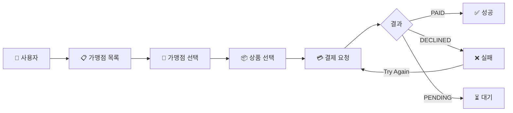
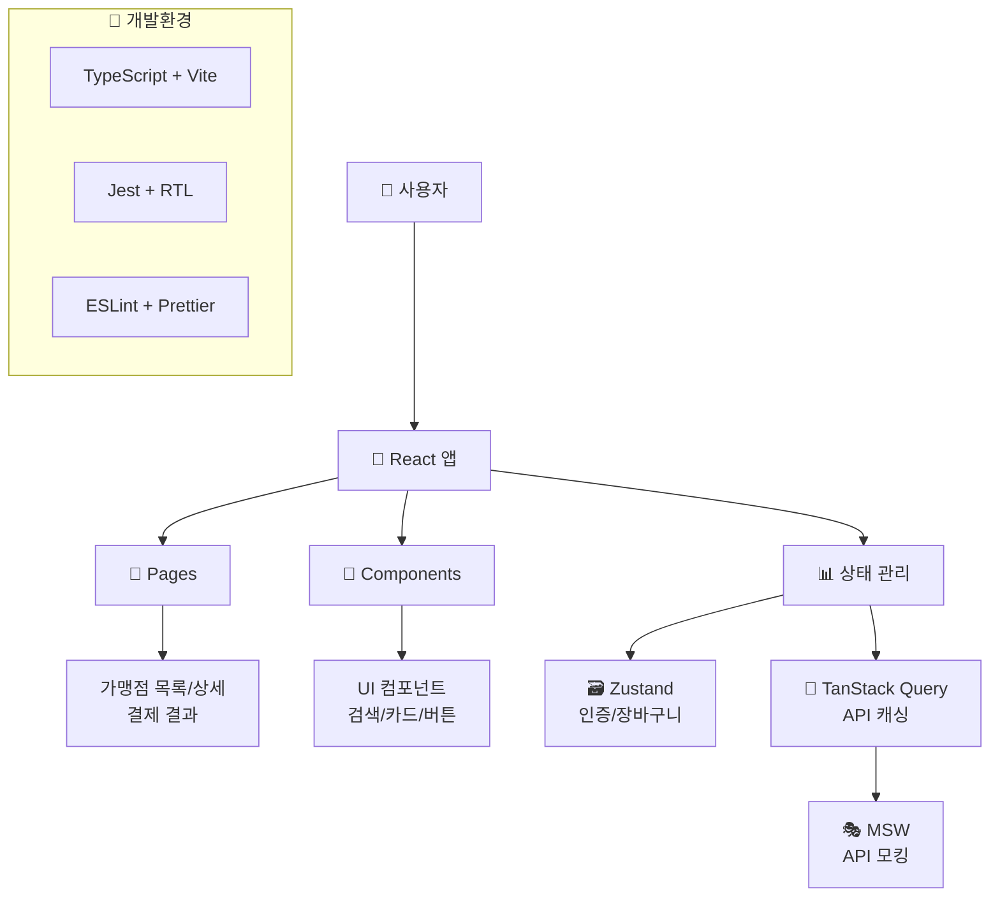

# Checkout UI


## 📋 프로젝트 개요

**결제 페이지 프론트엔드** 단일 리포지토리로, 가맹점 선택 → 상품 선택 → 결제 흐름을 구현한 반응형 웹앱입니다.

### 주요 기능

- 🏪 **가맹점 목록**: 20개 가맹점 (카페, 패스트푸드, 베이커리, 피자, 디저트)
- 🔍 **검색 및 정렬**: 이름순, 평점순, 거리순 정렬 지원
- 🛒 **장바구니**: 가맹점별 독립적인 장바구니 관리
- 💳 **결제 처리**: 카드·가상계좌 구분 지원, PENDING 상태 시뮬레이션, 10만원 초과 시 DECLINED
- 🌐 **다국어**: 한국어/영어 지원
- 📱 **반응형 디자인**: 모바일/데스크톱 최적화
- ✅ **테스트 커버리지**: 81.33%

## 🚀 빠른 시작

### 📋 요구 환경

| 항목 | 권장 버전 |
|------|-----------|
| Node.js | 20.x |
| pnpm | 10.15.0+ |

### 🛠 설치 및 실행

| 명령어 | 설명 |
|--------|------|
| `pnpm install` | 의존성 설치 |
| `pnpm dev` | 개발 서버 실행 (포트 3000) |
| `pnpm build` | 프로덕션 빌드 |
| `pnpm preview` | 빌드 프리뷰 (포트 4174) |
| `pnpm test` | 테스트 실행 |
| `pnpm test:watch` | 워치 모드 테스트 |
| `pnpm lint` | ESLint 검사 |
| `pnpm format` | Prettier 포맷팅 |

```bash
# 1. 저장소 클론
git clone <repository-url>
cd checkout-ui

# 2. 의존성 설치  
pnpm install

# 3. 개발 서버 실행
pnpm dev
# ➜ http://localhost:3000

# 4. 테스트 실행
pnpm test
```

> **💡 MSW 안내**: 모든 환경(개발/프리뷰/프로덕션)에서 MSW가 활성화되어 API 모킹이 동작합니다.

## 🛠 기술 스택 + 설계 결정

### Core Technologies
- **React 18.2.0**: UI 라이브러리
- **TypeScript 5.5.4**: 타입 안정성  
- **Vite 5.4.19**: 빌드 도구 및 개발 서버

### 상태 관리 & 데이터
- **Zustand 5.0.8**: 전역 상태 관리 (인증, 장바구니)
- **TanStack Query 5.85.5**: 서버 상태 관리 및 캐싱

### UI & 스타일링
- **Tailwind CSS 3.4.16**: 유틸리티 CSS 프레임워크
- **React Router DOM 7.8.1**: 클라이언트 사이드 라우팅
- **React i18next 15.7.2**: 다국어 지원

### 개발 도구 & 테스팅
- **Jest 30.0.5** + **React Testing Library 16.3.0**: 테스트 프레임워크
- **MSW 2.10.5**: API 모킹
- **ESLint** + **Prettier**: 코드 품질 관리

### 🔧 주요 설계 결정 (ADR 요약)

1. **CSR(Vite + React Router) 선택**: SEO 요구사항이 없어 SSR보다 개발 속도와 DX를 우선함
2. **Zustand 선택**: 단순하고 persist 지원이 있어 인증/장바구니 관리에 적합, Jotai보다 직관적
3. **TanStack Query 선택**: 서버 상태 관리와 캐싱/에러 처리를 라이브러리 수준에서 안정적으로 지원

## 🔄 사용자 작업흐름

### 🎯 사용자 플로우



## 🏛️ 시스템 아키텍처



## 🔄 상태 관리 & 데이터 패칭

### Zustand 스토어 구조

```typescript
// 인증 상태 관리
interface AuthState {
  token: string | null
  isAuthenticated: boolean
  setToken: (token: string) => void
  clearAuth: () => void
  refreshToken: () => Promise<void>
}

// 장바구니 상태 관리 (가맹점별 분리)
interface CartState {
  carts: Record<string, SelectedProduct[]> // merchantId -> products
  getCurrentCart: (merchantId: string) => SelectedProduct[]
  addProduct: (merchantId: string, product: Product) => void
  removeProduct: (merchantId: string, productId: string) => void
  clearMerchantCart: (merchantId: string) => void
  getTotalAmount: (merchantId: string) => number
  getTotalItems: (merchantId: string) => number
}
```

### TanStack Query 키 구조

```typescript
// 주요 queryKey 패턴
queryKey: ['merchants', params]           // 가맹점 목록
queryKey: ['merchant', id]                // 가맹점 상세
queryKey: ['products', merchantId]        // 상품 목록
```

## 💳 결제 도메인 규칙

### 결제 한도 및 상태 분기

- **한도**: **100,000 KRW 초과** → `DECLINED`
- **환율**: USD → KRW (1:1300)

### 결제 상태별 처리

| 상태 | 트리거 조건 | UI 라우팅 | 추가 동작 |
|------|-------------|-----------|-----------|
| `PAID` | 일반 카드 결제 성공 | `/payment/result/paid` | 장바구니 초기화 |
| `DECLINED` | 한도 초과 또는 실패 | `/payment/result/declined` | Try Again 지원 |
| `PENDING` | 가상계좌 가맹점 | `/payment/result/pending` | 계좌 정보 표시 |

### 가상계좌 (PENDING) 트리거

- 일부 가맹점은 가상계좌 전용으로 설정되어 `PENDING` 처리됩니다.
- 실제 서비스에서는 입금 확인 폴링/웹훅 처리

## 📱 주요 화면

### 1. 가맹점 목록 (`/`)
- 20개 가맹점 표시 (카페, 패스트푸드, 베이커리 등)
- 검색 기능 (가맹점명)
- 정렬 기능 (이름순/평점순/거리순)
- 반응형 그리드 레이아웃

### 2. 가맹점 상세 (`/merchants/:id`)
- 가맹점 정보 (이름, 평점, 거리, 설명, 연락처)
- 상품 목록 및 장바구니 기능
- 결제 버튼 및 플로우

### 3. 결제 결과 페이지
- `/payment/result/paid` - 결제 성공
- `/payment/result/declined` - 결제 실패
- `/payment/result/pending` - 결제 대기

## 🌐 국제화(i18n) & 접근성(A11y)

### 국제화 지원
- **지원 언어**: 한국어(기본), 영어
- **리소스 구조**: `src/locales/{ko,en}/common.json`
- **언어 전환**: `LanguageSelector` 컴포넌트로 `changeLanguage` 호출

```typescript
// 사용 예시
const { t } = useTranslation('common')
return <p>{t('merchants.title')}</p> // "가맹점 목록"
```

### 접근성 준수
- **시맨틱 마크업**: `<header>`, `<main>`, `<section>` 적절히 사용
- **ARIA 속성**: `role="button"`, `aria-label`, `aria-hidden` 설정
- **키보드 내비게이션**: `tabIndex={0}`, 포커스 트랩 지원
- **스크린리더 친화**: 의미 있는 라벨과 설명 제공

```jsx
// 대표 코드 예시
<div role="button" tabIndex={0} aria-label={`${merchant.name} 선택하기`}>
  
</div>
```

## 🚦 API 엔드포인트

> **참고**: 원본 요구사항 스펙에서 일부 확장된 부분이 있습니다. 자세한 변경사항은 하단 "API 스펙 변경사항" 섹션 참조.

### 인증
- `POST /api/auth/token` - 토큰 발급
  - **Request**: `{}` (deviceId 불필요)
  - **Response**: `{ success: boolean, data: { token: string, expiresIn: number, type: string } }`

### 가맹점
- `GET /api/merchants?query=&sort=` - 가맹점 목록
  - **Query**: `query` (검색어), `sort` (정렬: name|rating|distance)
  - **Response**: `[{ id, name, category, distanceKm, rating, logoUrl, description, phone, address, paymentMethod }]`

- `GET /api/merchants/:id` - 가맹점 상세
  - **Response**: `{ id, name, description, address, phone }`

- `GET /api/merchants/:id/items` - 가맹점 상품 목록
  - **Response**: `[{ id, name, price, currency, imageUrl, description, category, isAvailable }]`

### 주문
- `POST /api/orders` - 주문 생성
  - **Request**: `{ merchantId: string, currency: string, amount: number }`
  - **Response**: `{ status: 'PAID'|'DECLINED'|'PENDING' }`

## 🧪 테스트

### 테스트 실행
```bash
# 모든 테스트 실행
pnpm test

# 워치 모드
pnpm test:watch
```

### 테스트 커버리지: **81.33%** 🎯

### 주요 테스트 케이스

| 카테고리 | 테스트 대상 | 주요 시나리오 |
|----------|-------------|---------------|
| **단위 테스트** | useAuthStore, useCartStore | 토큰 관리, 가맹점별 장바구니 분리 |
| **컴포넌트 테스트** | MerchantCard, MerchantListPage | 검색/정렬, 빈 상태, 로딩 |
| **통합 테스트** | MerchantDetailPage | 결제 플로우, PAID/DECLINED/PENDING 분기 |
| **Edge Case** | - | 빈 상품 목록, 10만원 초과 결제 |

### 테스트 파일 구조
```
src/
├── pages/MerchantListPage.test.tsx
├── features/merchants/components/list/MerchantCard.test.tsx
├── pages/MerchantDetailPage.test.tsx
├── stores/useAuthStore.test.ts
└── stores/useCartStore.test.ts
```

## 📁 프로젝트 구조

```
src/
├── components/           # 전역 공통 컴포넌트
│   ├── Button.tsx
│   ├── LanguageSelector.tsx
│   └── Select.tsx
├── features/            # 기능별 모듈
│   └── merchants/
│       └── components/
│           ├── detail/   # 상세 페이지용 컴포넌트
│           │   ├── MerchantDetailHeader.tsx
│           │   ├── MerchantInfo.tsx
│           │   ├── ProductList.tsx
│           │   └── PurchaseButton.tsx
│           ├── list/     # 목록 페이지용 컴포넌트
│           │   ├── MerchantCard.tsx (+ .test.tsx)
│           │   ├── MerchantCardSkeleton.tsx
│           │   ├── SearchBar.tsx
│           │   └── SortDropdown.tsx
│           └── shared/   # 가맹점 기능 공통 컴포넌트
│               ├── EmptyState.tsx
│               └── StarRating.tsx
├── hooks/               # 커스텀 훅
│   ├── api.ts          # TanStack Query 훅 (useMerchants, useProducts 등)
│   └── useFormatting.ts # 포맷팅 훅
├── pages/               # 페이지 컴포넌트 (라우팅 대상)
│   ├── MerchantListPage.tsx (+ .test.tsx)    # 라우트: /
│   ├── MerchantDetailPage.tsx (+ .test.tsx)  # 라우트: /merchants/:id
│   ├── PaymentSuccessPage.tsx               # 라우트: /payment/result/paid
│   ├── PaymentFailedPage.tsx               # 라우트: /payment/result/declined
│   └── PaymentPendingPage.tsx              # 라우트: /payment/result/pending
├── shared/              # 공유 모듈
│   ├── api/            # MSW 관련
│   │   ├── api.ts      # HTTP 클라이언트
│   │   ├── browser.ts  # MSW 브라우저 설정
│   │   ├── handlers.ts # MSW 핸들러
│   │   └── mockData.ts # 목 데이터
│   ├── constants.ts    # 상수 (결제 한도, 환율 등)
│   └── lib/           # 유틸리티
│       ├── Providers.tsx
│       ├── generateToken.ts
│       └── queryClient.ts
├── stores/              # Zustand 스토어
│   ├── useAuthStore.ts (+ .test.ts)  # 인증 토큰 관리
│   └── useCartStore.ts (+ .test.ts)  # 가맹점별 장바구니 관리
├── locales/             # i18n 리소스
│   ├── ko/common.json   # 한국어
│   └── en/common.json   # 영어
├── lib/                 # 라이브러리 설정
│   └── i18n.ts         # i18next 설정
├── types.ts             # 글로벌 타입 정의
├── main.tsx            # 엔트리 포인트 (MSW + 라우팅 설정)
└── test-setup.ts       # Jest 테스트 설정
```

## 📊 Mock 데이터

### 가맹점 데이터
- 20개 가맹점 (스타벅스, 맥도날드, 롯데리아 등)
- 카테고리별 분류
- 평점, 거리, 연락처 정보

### 상품 데이터  
- 가맹점별 상품 목록
- 가격, 설명, 재고 상태
- 다양한 카테고리 (커피, 햄버거, 빵, 피자 등)

## 🔒 보안

- Bearer 토큰 기반 인증
- API 요청 시 토큰 검증
- XSS 방지 (React의 JSX는 기본적으로 XSS 방지를 지원합니다.)
- **참고**: 현재 프로젝트 범위에서는 localStorage persist 사용 

## 📈 성능 최적화

- **React Query**: API 응답 캐싱
- **Memoization**: API 파라미터 메모이제이션
- **Code Splitting**: 필요시 구현 가능
- **Image Optimization**: 필요시 구현 가능

## 🐛 주요 오류 및 해결 과정

### 1. MSW 초기화 실패로 인한 앱 중단 문제

**문제 현상**
- 개발 환경에서 MSW(Mock Service Worker) 초기화가 실패하면 앱 전체가 렌더링되지 않고 흰 화면만 표시됨

**원인 분석**
- 서비스 워커 캐시 충돌 및 버전 불일치
- `worker.start()`가 무한 대기 상태에 빠지고, 에러 처리가 없어 앱이 멈춤

**해결 방법**
- MSW 시작 시 타임아웃 추가하여 무한 대기 방지
- 기존 서비스 워커 자동 정리 로직 구현
- MSW 초기화 실패 시에도 앱은 계속 실행되도록 fallback 처리

```typescript
const timeoutPromise = new Promise((_, reject) => {
  setTimeout(() => reject(new Error('MSW start timeout')), 10000)
})

await Promise.race([startPromise, timeoutPromise])
```


### 2. 토큰 만료 시 401 Unauthorized 오류

**문제 현상**
- 페이지를 장시간 열어두면 API 호출 시 "가맹점을 찾을 수 없습니다" 오류 발생

**원인 분석**
- API 클라이언트에 토큰 제공자가 초기화되지 않음
- 토큰 만료 이후 자동 갱신 로직이 없어 401 응답 발생

**해결 방법**
- 앱 시작 시 `initializeApi()` 실행하여 tokenProvider 설정
- 401 응답 시 자동으로 새 토큰 발급 후 원래 요청을 재시도하는 로직 추가

```typescript
api.addRequestInterceptor(async (config) => {
  const token = await tokenProvider()
  config.headers.Authorization = `Bearer ${token}`
  return config
})
```

### 3. 가맹점별 장바구니 분리

**문제 현상**
- 전역 장바구니 구조로 인해 여러 가맹점의 상품이 한 장바구니에 섞임
- UX 상 "가맹점 A에서 담은 상품"이 "가맹점 B 결제"에 노출되는 문제 발생

**원인 분석**
- 상태 구조가 단일 배열(`selectedProducts`)로 설계되어 가맹점 구분 불가능

**해결 방법**
- Zustand 스토어를 `Record<merchantId, SelectedProduct[]>` 구조로 리팩토링
- 가맹점 결제 완료 시 해당 가맹점 장바구니만 초기화하도록 로직 수정

```typescript
interface CartState {
  carts: Record<string, SelectedProduct[]> // 가맹점별 장바구니
  getCurrentCart: (merchantId: string) => SelectedProduct[]
  addProduct: (merchantId: string, product: Product) => void
  removeProduct: (merchantId: string, productId: string) => void
  clearMerchantCart: (merchantId: string) => void
  getTotalAmount: (merchantId: string) => number
  getTotalItems: (merchantId: string) => number
}
```


## 📋 요구사항 준수 현황

### 필수 기능 요구사항 (100% 완료)

#### 1. 인증/세션
- [x] 앱 진입 시 임의 토큰 발급 (`generateToken()`)
- [x] 로컬 저장 (`localStorage` 기반 Zustand)
- [x] 모든 API 호출에 `Authorization: Bearer <token>` 헤더 포함

#### 2. 가맹점 목록
- [x] 가맹점 목록 API 호출
- [x] 검색 기능 (`SearchBar`)
- [x] 정렬 기능 (이름순, 평점순, 거리순)
- [x] Empty UI (`EmptyState`)
- [x] Skeleton UI (`MerchantListSkeleton`)
- [x] 가맹점 클릭 시 상세 이동

#### 3. 가맹점 상세
- [x] 가맹점 상세 정보 API 호출
- [x] 상품 목록 API 호출
- [x] 통신 에러 시 UI 구현
- [x] 상품 선택 시 금액 동적 변경
- [x] Pay 버튼 클릭 시 결제 API 호출

#### 4. 결제 결과
- [x] `PAID` → 성공 페이지 (`PaymentSuccessPage`)
- [x] `DECLINED` → 실패 페이지 (`PaymentFailedPage`)  
- [x] `PENDING` → 대기 페이지 (`PaymentPendingPage`)
- [x] Try Again 재호출 기능

#### 5. 접근성(A11y)
- [x] 시맨틱 마크업 (`<header>`, `<main>`, `role` 속성)
- [x] 적절한 aria 속성 (`aria-label`, `aria-hidden`)
- [x] 키보드 내비게이션 지원

#### 6. 상태 관리 & 데이터 패칭
- [x] Zustand: 인증 토큰, 장바구니 전역 관리
- [x] TanStack Query: 서버 상태, 캐시, 에러 처리

### 선택 요구사항 구현 완료
- [x] **국제화(i18n)**: ko/en 셀렉터 및 통화 현지화
- [x] **단위/컴포넌트 테스트**: Jest + RTL, 81.33% 커버리지
- [x] **메모화**: API 파라미터 메모이제이션
- ⚠️ **코드 스플리팅/이미지 지연 로딩**: 현재 규모에 불필요하다고 판단

### 기술 스택 준수
- **필수**: [x] TypeScript, React, TanStack Query
- **권장**: [x] Tailwind, Zustand, React Router Dom, Vite, Jest + RTL, MSW

## 📋 API 스펙 변경사항

> 요구사항에서 제시된 Mock API 스펙을 기반으로 구현하되, 실제 사용성을 위해 일부 확장했습니다.

### 1. **인증 API** - 응답 구조 확장
```diff
// 원본 요구사항
POST /api/auth/token
req: { deviceId }
res: { token, expiresIn }

// 실제 구현
POST /api/auth/token
req: {} // deviceId 불필요로 판단
res: { 
+  success: true,
+  data: { 
     token, 
     expiresIn: 3600,
     type: 'Bearer'
+  }
}
```

**변경 사유**:
- `deviceId` 제거: 현재 프로젝트 범위에서 디바이스 추적이 불필요
- `success` 필드 추가: API 응답의 성공/실패 상태를 명확히 구분
- `type: 'Bearer'` 추가: 토큰 타입을 명시하여 클라이언트에서 올바른 Authorization 헤더 구성 지원

### 2. **가맹점 목록 API** - 필드 확장
```diff
// 원본 요구사항
res: [{ id, name, category, distanceKm, rating, logoUrl }]

// 실제 구현 (상세 정보도 포함)
res: [{ 
  id, name, category, distanceKm, rating, logoUrl,
+ description, phone, address, paymentMethod 
}]
```

**변경 사유**:
- **결제 플로우 최적화**: `paymentMethod` 정보를 미리 제공해 가상계좌/카드 결제 분기 처리 가능
- **목데이터 구조 활용**: 단일 목데이터 파일에 모든 정보가 포함되어 있어 효율적인 데이터 제공 가능

### 3. **상품 목록 API** - 필드 확장
```diff
// 원본 요구사항  
res: [{ id, name, price, currency, imageUrl }]

// 실제 구현
res: [{ 
  id, name, price, currency, imageUrl,
+ description, category, isAvailable 
}]
```

**변경 사유**:
- **상품 정보 완성도**: `description`으로 상품에 대한 자세한 설명 제공
- **카테고리 분류**: `category` 필드로 상품 그룹화 및 필터링 기능 구현 가능
- **재고 관리**: `isAvailable`로 품절 상품 처리 및 사용자에게 명확한 상태 표시

### 4. **결제 API** - 동일 ✅
```javascript
POST /api/orders
req: { merchantId, currency, amount }
res: { status: 'PAID'|'DECLINED'|'PENDING' }
```

### 5. **추가 비즈니스 로직**
- **결제 한도**: 100,000 KRW 초과 시 자동 DECLINED
- **가상계좌**: 특정 가맹점은 무조건 PENDING 처리  
- **환율 지원**: USD → KRW 변환 (1:1300)

**비즈니스 로직 추가 사유**:
- **결제 한도**: 실제 결제 서비스의 일반적인 한도 제한 시뮬레이션 및 에러 상황 테스트
- **가상계좌 분기**: 실제 결제 도메인의 복잡성을 반영하여 다양한 결제 상태 처리 검증
- **다중 통화 지원**: 글로벌 서비스 확장성을 고려한 통화 변환 로직 구현
